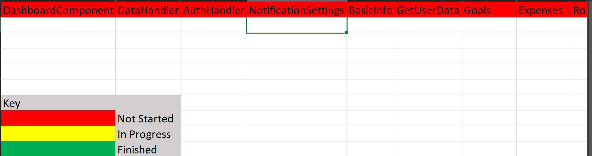

# Verification Process
```
Requirements changes (will be updated on requirements specification by May 19 at 5 PM):
   * We will no longer be having custom goals
```

Tracking requirements: We will be keeping track of tests and finished components in an Excel spreadsheet (stoplight diagram), by listing which tests have been completed under their respective components. A component can only be considered finished, and highlighted green, if all of its tests have passed. Once all tests pass for a component and it is considered finished, then it can be committed to the master branch.

1. [General] Text input forms will not accept empty strings as valid inputs
  * We will conduct a manual test in which we enter in an empty string and attempt to submit or move to next page; if it moves to next page, the test failed, if it does not, the test passed
  * We will integrate this verification into our process by having each team member who implements a component containing text input forms conduct the manual test on each text input form before the component can be considered finished and committed to the master branch
2. [User creation] When signing up, users enter their email; emails must be in a valid email format (ex: [name@email.com](mailto:name@email.com))
  * We will conduct  either a manual test in which we will test a range of valid and invalid email addresses by attempting to use them in the creation of a new account. If a valid email allows a new user account to be created, and if an invalid email does not allow a new user account to be created, the test passes. Email addresses that will be tested can be found in this list:
    - Valid email addresses
      1. [prettyandsimple@example.com](mailto:prettyandsimple@example.com)
      2. [common@example.com](mailto:very.common@example.com)
      3. [style.email.with+symbol@example.com](mailto:disposable.style.email.with+symbol@example.com)
      4. [email-with-dash@example.com](mailto:other.email-with-dash@example.com)
      5. [fully-qualified-domain@example.com](mailto:fully-qualified-domain@example.com)
      6. x@example.com
      7. &quot; [unusual.@.unusual.com](about:blank)&quot;@example.com
      8. &quot;very.(),:;&lt;&gt;[]\&quot;.VERY.\&quot;very@\\&quot;very\&quot;.unusual&quot;@strange.example.com
      9. [example-indeed@strange-example.com](mailto:example-indeed@strange-example.com)
      10. admin@mailserver1 (local domain name with no TLD)
      11. ~~/#!$%&amp;&#39;\*+-/=?^\_`{}|~@example.org~~
      12. ~~&quot;()&lt;&gt;[]:,;@\\&quot;!#$%&amp;&#39;-/=?^\_`{}| ~.a&quot;@example.org~~
      13. &quot; &quot;@example.org (space between the quotes)
      14. example@s.solutions (see the List of Internet top-level domains)
      15. user@localserver
      16. user@tt (although ICANN highly discourages dotless email
      17. addresses)
      18. user@[IPv6:2001:DB8::1]
    - Invalid email addresses
      1. Abc.example.com (no @ character)
      2. A@b@c@example.com (only one @ is allowed outside quotation marks)
      3. a&quot;b(c)d,e:f;gi[j\k]l@example.com (none of the special characters in this local-part are allowed outside quotation marks)
      4. just&quot;not&quot;right@example.com (quoted strings must be dot separated or the only element making up the local-part)
      5. this is&quot;not\allowed@example.com (spaces, quotes, and backslashes may only exist when within quoted strings and preceded by a backslash)
      6. this\ still\&quot;not\allowed@example.com (even if escaped (preceded by a backslash), spaces, quotes, and backslashes must still be contained by quotes)
      7. 1234567890123456789012345678901234567890123456789012345678901234+x@example.com (too long)
      8. john..doe@example.com (double dot before @)
      9. example@localhost (sent from localhost)
with caveat: Gmail lets this through, Email address#Local-part the dots altogether
      10. john.doe@example..com (double dot after @)
      11. &quot;much.more unusual&quot;@example.com

  * We will integrate this verification into our process by requiring the team member whose task it is to complete the AuthHandler component to conduct the manual test of attempting each email and verifying all results are passing before the AuthHandler component is considered to be finished and can be committed to the master branch
3. [Notifications] Users will receive reminders if they have not updated their spending information within the time period that they specified on the &quot;Notification Settings&quot; page. This time frame will be enforced via a timestamp saved in firebase when the user updates their spending information. This timestamp will be compared against the current date.
  * To verify this requirement, the developer of the NotificationSettings component will conduct a manual test by inputting small time intervals like 1 minute, 5 minutes, 10 minutes, and verifying that a notification is received in the desired format in the inputted time interval. If a notification is not received directly after the set time then the test fails, if a notification is received directly after the set time then the test passes.
  * We will integrate this verification into our process by requiring the team member who implements the NotificationSettings component to conduct the manual test and ensure that it passes in all trials before the component can be considered finished and committed to the master branch.
4. [Settings/Spending]For monthly income, monthly savings, and monthly expenses, users must input numerical values representing US dollars and cents
  * To verify this requirement, the project manager will conduct a code inspection to ensure the developer is properly verifying that all inputs are numeric values that represent dollars and cents, and does not allow non-numeric or numeric values that do not represent dollars and cents to be stored. If the developer correctly tests for numeric values by using isNaN() and then correctly tests if the numeric value is &gt; 0 then the inspection would be passed, if the project manager identifies errors in the implementation of the developer&#39;s code that would result in incorrect information being stored then the inspection fails and the inspector will provide feedback on how to make corrections.
  *  The project manager will conduct the inspection with the developer of any component containing numeric dollar and cent input boxes before the component can be considered finished and able to be committed to the master branch
```
5. [User Info, Goals, Expenses, Settings] Once the user hits &quot;Save,&quot; the information on this page should be sent to GetUserData stored in an Object
  * The team member whose task it is to complete the GetUserData component will conduct an inspection to be sure that all the information on the page (properties relevant to User Info, Goals, Expenses, or Notification Settings) is being stored and sent to GetUserData correctly. The inspector will do this by ensuring that the object that is storing the information to be sent to GetUserData is storing the information accurately and correctly by making sure the object contains all the proper keys that GetUserData is expecting, and by making sure all values for those keys are containing the entirety of the desired information. If the inspector confirms that the proper information is being sent to GetUserData then the inspection passes, if not it fails, and the inspector will provide feedback on how to make corrections.
  * The proper values for GetUserData are based on UserInfo, UserExpenses, UserGoals, and UserNotification Settings. UserInfo should include values to represent estimated monthly income and savings, number of dependents, number of members in a household, and booleans representing whether a user is a full-time student or dependent or works less than 40 hours a week. UserExpenses should include key-value pairs with the name of the expenses cateogory as a string, and the values being numerical. UserGoals should store key-value pairs about goals with the label of the form being the key and the user input being the value. UserNotificationSettings should store key-value pairs with the label of the question as the key and the value as the user input for timeframe and method. 
  * To know what to check for, these are the inputs in each field before the user presses Save (formatted as PropertyName { value, value, value }): 
      - Case 1: UserInfo { 4000, 500, 0, 1, no, no, no }, UserExpenses { Rent : 1200, Food: 500, Transportation : 75, Starbucks : 50, Video Games : 200, Travel : 500 }, UserGoals { Savings : 750, Necessities : 2000, Discretionary : 1250 }, UserNotificationSettings { Timeframe: 2 weeks, Method : Email}
      - Case 2: UserInfo { 10000, 1000, 1, 2, no, no, no }, UserExpenses { Rent : 2000, Food: 2000, Daycare : 1000, Preschool : 500, Shopping : 500, Ice Cream : 100 }, UserGoals { Savings : 2000, Necessities : 7000, Discretionary : 1000 }, UserNotificationSettings { Timeframe: 1 week, Method : Text }
  * The inspector will conduct their inspection with the developer of each component that sends information to GetUserData via an object before the component can be considered finished and able to be committed to the master branch
  ```
6. [User Info, Goals, Expenses, Spending, Settings] Once the user hits &quot;cancel,&quot; all the input will be erased and the app will go back to whatever their previous screen was
  * To verify this requirement we will conduct a manual test, in which we will write text in each input box, then click the cancel button. If, after hitting the cancel button, we are redirected to our previous page, and when we reopen the same page with input boxes all input boxes are blank, then the test passes. If any other outcome occurs, then the test fails.
  * We will integrate this verification into our process by requiring each team member whose task it is to develop either the User Info, Goals, Expenses, Spending, or Settings components to conduct the manual test before each component can be considered finished and committed to the master branch.
7. [Basics] If the user selected the &quot;other&quot; category on the &quot;Basics&quot; screen, under the page title and instructions, a darker panel should appear spanning the right hand side of the page.
  * Automated Test: The test will select  the &quot;other&quot; category button, and will expect the &#39;open&#39; state of the collapse/drawer that the darker panel is contained in to be true
  * This will also be validated through another teammate selecting the &quot;other&quot; category while testing the UX to ensure that the darker panel to appear and be in the correct location.
  * This will be implemented into our process by requiring the team member who implements the BasicInfoComponent to ensure that the component passes the test before it can be considered finished and committed to the master branch
8. [User Info, Expenses] Users can only click the &quot;Save&quot; Button after filling in all three input boxes
  * Automated Test: The test will check the &quot;disabled&quot; property of the &quot;save&quot; button based on a variety of cases
    - Case 1: No forms are completed
    - Case 2: All required forms are completed
    - Case 3: Three forms are completed, but the savings form is not one of them
    - Case 4: Three forms are completed, but the income form is not one of them
9. [Goals] Errors that appear when setting goals: if an error occurs, an alert will pop up in a rectangular box in the middle of the screen with a title for the alert, a description of the alert, and buttons in the right hand bottom corner of the screen that say
  * Automated Test: Different values that are known to trigger errors will be passed to the various forms. The test will validate whether the &quot;show&quot; state for the error box becomes true in situations where an error should occur.
    - Case 1: A value greater than 40% is passed to the &quot;savings goal&quot; form. This should trigger an error, and the &quot;show&quot; state for the error box should be true
    - Case 2: 40% is passed to the &quot;savings goal&quot; form. This is the cutoff point, and should not change the &quot;show&quot; state to true.
    - Case 3: A value less than 40% is passed to the &quot;savings goal&quot; form. This should not trigger an error, and therefore the &quot;show&quot; state for the error box should remain false.
    - Case 4: 50% is passed to the &quot;discretionary goal&quot; form. This is the cutoff point, and should not change the &quot;show&quot; state to true.
    - Case 5: A value less than 50% is passed to the &quot;discretionary goal&quot; form. This is a valid amount and should not change the &quot;show&quot; state to true.
    - Case 6: A value greater than 50% is passed to the &quot;discretionary goal&quot; form. This should trigger an error, and should change the &quot;show&quot; state to true.
    - Case 7: Percentage values are passed to all three goal forms that do not add up to 100%. This should throw an error, and therefore should change the &quot;show&quot; state of the error box to true.
```10. [User Creation] User information will be saved in a JSON object as they are entering it in. Once the submit button is hit, this object will be pushed to firebase all at once. We will use a manual test (i.e. signing up as a new user by entering a full name, username, password, re-entering password, and pressing submit, and then checking Firebase to see if user information is stored correctly).
    - Enter following values as input to Full Name, Username, Password, and Password Confirmation boxes; once we check Firebase, these are the values that should appear:
          - Case 1: Cute Corgi, cutecorgi, IAmACuteCorgi33, IAmACuteCorgi33
          - Case 2: Andrew Donut, ADonut, notAndr3wB3g3l, notAndr3wB3g3l
          - Case 3: Harry Husky, HarryTheHusky, purplereign, purplereign
  * The team member whose job it is to create the auth handler will conduct an inspection to ensure that the user data is being stored in firebase correctly. The inspector will do this by entering mock values into the sign up form, and then checking the firebase console to see if the data exists and if the format is correct.
  ```
11. [Sign In] Passwords must be at least 6 characters in length
  * Validation will be placed on the password forms in the sign up component (both the initial password form and the confirmation form). This validation function will check the length of the value entered into the form, and if it is less than 6 characters, the validation state of the form will be changed to &quot;error&quot;. This will look like a red outline surrounding the form containing the issue, indicating that there is an error.
12. [Sign In]User information successfully stored in Firebase and can be found when a user logs in - Firebase in-house authentication: use the username and password of an existing user and attempt to log in; if successful, redirects to dashboard; if unsuccessful, does not allow them to sign in
  * The members who created the router and the authentication handler will come together and conduct an investigation to evaluate whether the two components are able to work hand in hand. The investigation will include using the credentials of an existing &quot;user&quot; to log in, and then ensuring that the application reroutes to the dashboard component. Likewise, the investigation should test that the application does not reroute when the log in function is unsuccessful.
13. [General] When going back to a previous form, values already entered and saved in firebase should fill out the forms
  * Members who created each data component will conduct an investigation on whether or not the forms on their component are populated with values already saved in firebase when the component is rendered. The investigation will check that data is present when using the &quot;back&quot; button from another component, as well as from opening the component from the hamburger menu. If there is no prior data stored in firebase, the form should appear empty.
14. [Dashboard] In the bottom-left corner, a panel/section titled &quot;Spending&quot; contains information about how much a user is currently spending on categories of expenses per month, what the application suggests the user should be spending, what they have spent so far this month, and whether the user is over and/or under budget
  * Prerequisites for the test: must be logged into a user&#39;s account with information related to spending, saving, and goals inputted; DataHandler component must be verified already
  * Integration test (manual): since this chart will pull all its information from the DataHandler component, the developer who implements this part of the Dashboard will execute a test that calls getUserInfo() and calculateRecommended() and check that those values equal the values on the &quot;Spending&quot; section of the Dashboard in order to verify this requirement as passing
  * Example test case: User &#39;Andy Ko&#39; has inputted that he makes $12,000 a month, spends $3,000 a month on 3D printing, $6,000 on necessities, $2,000 on a &quot;treating myself&quot; category, and saves $1,000, and his goal is to cut down on 3D printing and &quot;treating myself&quot; and increase savings. Since DataHandler works correctly, getUserInfo() should return the information above and calculateRecommended() should suggest $6,000 on necessary spending, $2,400 on savings, and $2,400 on 3D printing, and $1,200 on &quot;treating myself. The numerical values on the Dashboard in the &quot;Spending&quot; section should match these values.
15. [Dashboard] To the right of the &quot;Goal&quot; box will be a radial/pie chart titled &quot;Overall Breakdown&quot;. This display will take all of the various categories that the user spends money on (food, coffee, housing, etc.) and display these categories on the pie chart based on how much the user spends in each category.
  * Prerequisites for the test: must be logged into a user&#39;s account with information related to spending, saving, and goals inputted; DataHandler component must be verified already
  * Integration test (manual): since this chart will pull all its information from the DataHandler component, the developer who implements this part of the Dashboard will execute a test that calls getUserInfo() and checks that those values equal the equivalent percentages on the &quot;Overall Breakdown&quot; section of the Dashboard in order to verify this requirement as passing
  * Example test case: User &#39;Andy Ko&#39; has inputted that he makes $12,000 a month, spends $3,000 a month on 3D printing, $6,000 on necessities, $2,000 on a &quot;treating myself&quot; category, and saves $1,000 so getUserInfo() should return those values as well as returning 25% of monthly income is spent on 3D printing, 50% on necessities, 16% on &quot;treating myself&quot; and 8% of savings. These percentages should match the percentages listed on the pie chart in the &quot;Goal Box&quot; of the Dashboard.
16. [Dashboard] Next to the &quot;Overall Breakdown&quot; display will be a bar diagram titled &quot;Actual vs Suggested Spending&quot;. This bar diagram will compare the suggested spending amounts for the user to what they currently spend in each category.
  * Prerequisites for the test: must be logged into a user&#39;s account with information related to spending, saving, and goals inputted; DataHandler component must be verified already
  * Integration test (manual): since this chart will pull all its information from the DataHandler component, the developer who implements this part of the Dashboard will execute a test that calls getUserInfo() and calculateRecommended() and checks that those values match the values on the &quot;Actual vs Suggested Spending&quot; section of the Dashboard in order to verify this requirement as passing
  * Example test case: User &#39;Andy Ko&#39; has inputted that he makes $12,000 a month, spends $3,000 a month on 3D printing, $6,000 on necessities, $2,000 on a &quot;treating myself&quot; category, and saves $1,000. Since DataHandler works correctly, getUserInfo() should return the information above and calculateRecommended() should suggest $6,000 on necessary spending, $2,400 on savings, and $2,400 on 3D printing, and $1,200 on &quot;treating myself. These values should match the bars in the bars diagrams on the Dashboard in the &quot;Actual vs Suggested Spending&quot; section should match these values.
17. [Router] When the user opens the hamburger menu, the options &quot;Dashboard&quot;, &quot;Expenses&quot;, &quot;Goals&quot;, and &quot;Settings&quot; should display; once the user clicks, each option should send the user to their respective page; this should work in numerous browsers
  * Prerequisite: user must be logged in
  * Manual test: the developer in charge of the Router component will click on Pages from the Menu; if it redirect to the respective page, the test has passed. Test cases:
    - Case 1: in Chrome, click on Dashboard, is redirected to Dashboard
    - Case 2: Click on Expenses, is redirected to Expenses
    - Case 3: Click on Goals, is redirected to Goals
    - Case 4: Click on Settings, is redirected to Settings
    - Case 5: repeat cases 1-4 in Safari
    - Case 6: repeat cases 1-4 in Mozilla Firefox
  * This test will be conducted every time one of the following components is finished (if all have not been completed yet, the ones that have not been completed should fail): Dashboard, NotificationsSettings, Goals, Expenses

18. [Notification Settings] Users must select one of the options for timeframe and method, even if it&#39;s to have no notifications, before continuing to the next page.
  * Manual test: we will conduct a manual test in which the &#39;user&#39; does not select an option for timeframe, method, or both; if we are redirected to the next page after pressing &#39;Save&#39;, the test has failed. Cases:
    - Case #1: Do not select an option for timeframe, enter any option for method
    - Case #2: Do not select an option for method, enter any option for timeframe
    - Case #3: Do not select an option for timeframe or method
  * In order to integrate this into our process, the developer who implements the NotificationsSettings component will conduct this test manually after completing it. It must pass before the component can be considered finished and committed to the master branch
19. [Dashboard] Progress bars for goals change colors at appropriate status
  * Manual test: we will check that if a user&#39;s actual spending in a category is less than 90%, the progress bar fill in the &quot;Goals&quot; section of the Dashboard will be green; if it is between 90% and 99%, it will be yellow; if it is at 100% or above it will be green; if one case is not true, the test does not pass
  * Cases:
    - Case #1: User&#39;s suggested amount of spending on Starbucks is $50, they have spent $10 so far this month (bar should be green)
    - Case #2: User&#39;s suggested amount of spending on Starbucks is $50, they have spent $47 so far this month (bar should be yellow)
    - Case #3: User&#39;s suggested amount of spending on Starbucks is $50, they have spent $55 so far this month (bar should be red)
  * Prerequisite: be logged into a user account and user information should be set so bar color can be tested; Goals, Expenses, DataHandler components must be completed
  * Once this portion of the Dashboard is completed, the developer who implemented this portion will conduct the test. If any of the cases fail, this test cannot be committed to the master branch
20. [Notification Settings] In-app notifications should appear if the period the user identified has elapsed
  * Automated test that compares the last date of expenses being updated to the current date and evaluates how much time has gone by. Makes sure the alert does or does not appear
    - Case 1: If time period set to 2 weeks and time between last update and current date is 1 day
    - Case 2: If time period set to 2 weeks and time between last update and current date is 3 weeks
```21. [Expenses] Originally, four rows of prefilled text boxes saying “Category Name” and blank input boxes will appear. If the user would like to add more categories of discretionary expenses, they must press the “add additional categories” button. Once they hit that button, an additional row will appear with an “X” icon to the left of the “category name” text.To remove the additional categories that have been added, one presses the “X” and the row disappears along with the data potentially entered into it.
   * Manual test: once the developer who is in charge of the Expenses component believes the component is complete, the Project Manager will navigate to the Expenses page.
   * Test 1: The Project Manager will press the "add additional categories" button. An additional row should appear as specified above. If it does not appear as specified above, the test has failed.
   * Test 2: The Project Manager will press the "add additional categories" button three times. Three additional rows should appear as specified above. If it does not appear as specified above, the test has failed.
   * Test 3: The Project Manager will press the "X" icon. One row should disappear as specified above. If it does not disappear as specified above, the test has failed.
   * Test 4: The Project Manager will input "Test" into the input box for Category Name on the last row. Then they will press the "X" icon. One row should disappear with the input as specified above. If it does not disappear as specified above, the test has failed.
   * Test 5: The Project Manager will press the "X" icon on the left of the bottom two rows. The bottom two row should disappear with the input as specified above. If they do not disappear as specified above, the test has failed.
   ```
